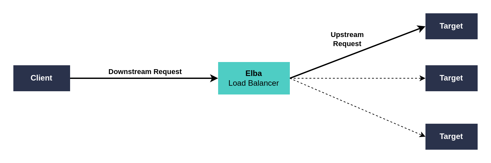

# Elba Concepts

Elba is a load balancer, that means:
- It'll receive requests (**downstream request**)
- Choose an available upstream **target**
- Send the **upstream request**
- Retry to another target if the first one fails and retries are configured.
- Proxy the **upstream response** or **upstream error** to the **downstream** client.

Here is a model of some words you might encounter in our docs:

## Next steps

Now that you understand the concepts behind Elba, check some of our modules:
- **[Load Balance Module](./load-balance.md)**: Balance the requests between your targets, define multiple services going through Elba, and choose how they will appear in the logs and monitoring.
- **[Retry Module](./retry.md)**: Retry failed requests, choose when a request is retried, how many times, define cooldowns, delays.
- **[Health Module](./health.md)**: Keep track of the health of each upstream target, remove unhealthy targets from the load balancing, define the rules to mark a target as UP or DOWN.
- **[Metrics Module](./metrics.md)**: Elba exposes many advanced metrics that will let you monitor the status of your environments and integrations.
- **[Logs Module](./logs.md)**: Understand how Elba logs the actions, downstream and upstream requests and responses to help you with troubleshooting issues with your integrations.
- **[Headers Module](./headers.md)**: Elba adds headers to the downstream responses to help with troubleshooting. Check how to use them.
