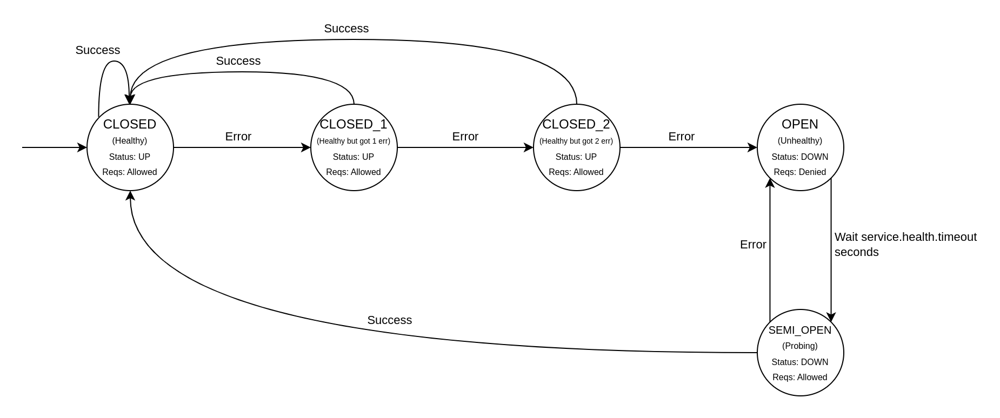

# Elba Health and Healthcheck module

## Settings
You can set the health settings for each service you create:

```toml
[server]
host      = "0.0.0.0"
port      = 8080
verbosity = "debug"


[[service]]
  [[service.target]]
  name = "instance001"
  url  = "https://elba.mockoapp.net/s1"

  [[service.target]]
  name = "instance002"
  url  = "https://elba.mockoapp.net/s2"

  [[service.target]]
  name = "instance003"
  url  = "https://elba.mockoapp.net/s3"

  [service.timeout]
  connect = 3   # Maximum seconds to wait for a connection to be established, default: 3
  target  = 30  # Maximum seconds to wait for a target's response, default: 30

  ###################
  # Health Settings #
  ###################
  [service.health]
  # Consecutive retriable errors to consider a target to be down, default: 3
  threshold = 3
  # Seconds to wait to mark a target as UP again, default: 10
  timeout   = 10
  # If all targets are down, balance between all of them instead of failing with 503
  # This can greatly increase the load in the upstream services because each request
  # received might go to all of them several times deppending on the retry settings
  # default: false
  none_healthy_is_all_healthy = false
```

# Target health
- Elba uses passive healthchecks, that is, no extra request is sent to the upstream services to check their health. Elba analises the traffic it proxies to check the health of each
- If a target reaches `service.health.threshold` **consecutive** failed upstream requests, it is marked as unhealthy.
  - Defaults to three failures.
  - An upstream request is considered as an error/failed if the status code returned by it or generated by elba is in the `service.retry.retryable_errors` setting.
  - You can check more information on that setting in the [retry module documentation](retry.md).
- Unhealthy targets stop receiving requests for `service.health.timeout` seconds.
- After `service.health.timeout` seconds, a target receives (most likely) one request and is marked as UP if the response is successful or continues to be down if the response is not successful.
  - (most likely because, until the response, the target is considered up and might get more requests in scenarios of high request rates)
- You can think of the health status of a target as the following state machine (for threshold = 3):

- As of now, Elba does not synchronize target status between instances. If you have many instances of Elba being balanced, your upstream services might receive a lot of requests when they are in the SEMI_OPEN status.
  - Also, targets will receive instances*threshold requests before being marked as down in every elba instance.
- You dont have to worry about downstream requests failing when an upstream target is down and elba is still detecting the `threshold` because the [retry module](retry.md) will retry the requests in other targets to absorb errors.
- To monitor the health of targets, check the [metrics module documentation](metrics.md).

# Elba healthcheck
Elba has a built-in healthcheck endpoint that can be used to check if it's running:
```shell
$ curl http://localhost:8080/__elba__/health

{
  "status": "ok",
  "upstreams": [
    {
      "host": "api.default.svc.cluster.local",
      "healthyTargets": [
        "instance001",
        "instance002",
        "instance003"
      ],
      "unhealthyTargets": []
    },
    {
      "host": "*",
      "healthyTargets": [
        "instance001",
        "instance002",
        "instance003"
      ],
      "unhealthyTargets": []
    }
  ]
}
```
