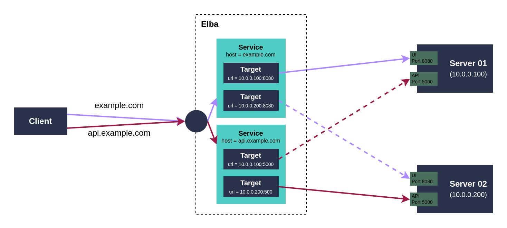

# Elba Load Balance module

## Settings

```toml
[server]
host      = "0.0.0.0"
port      = 8080
verbosity = "debug"


#
# You can define as many [[service]]s as you'd like, here is an example with
# all parameters (note that only the "targets" param is required, you can omit
# anything else)
#
[[service]]
## This service will be chosen when the Host header is equal to this value
## Leave this blank or remove/comment it to match any host:
# host = "api.default.svc.cluster.local"

## The default is to set the upstream Host header from its URL, if you want to
## proxy the Host header from the downstream request, uncomment this line:
# proxy_host = true

  # These are the URLs that will be balanced
  [[service.target]]
  name = "instance001"                  # Alias to show in the logs and metrics
  url  = "https://elba.mockoapp.net/s1" # URL to proxy to

  [[service.target]]
  name = "instance002"
  url  = "https://elba.mockoapp.net/s2"

  [[service.target]]
  name = "instance003"
  url  = "https://elba.mockoapp.net/s3"

  [service.timeout]
  connect = 3   # Maximum seconds to wait for a connection to be established, default: 3
  target  = 30  # Maximum seconds to wait for a target's response, default: 30

#
# You can define more services by repeating the above section from [[service]] to the end
#

```

# How load balancing works

- Each `[[service]]` represents a different service. You can balance between `[[service.target]]`s and define an alias for them using `service.target.name` for [logs](./logs.md) and [metrics](./metrics.md).
- Targets are chosen at random at upstream-request time. (No round-robin or session aware algorithms available, for now).
- To monitor the traffic being sent to each upstream target, check the [metrics module documentation](./metrics.md).
- Targets that are marked as down are skipped unless all of them are down and `service.health.none_healthy_is_all_healthy` is set to true.
- If `service.health.none_healthy_is_all_healthy` is set to false and all targets are down, the request will fail with 503.
- To understand how targets are marked as down or up, check the [health module documentation](./health.png).
- A single downstream request can be retried on different targets so the client doesn't experience any downtime even when a target fails. Check the [retry module documentation](./retry.md) for more information.
- For more information on how to troubleshoot which requests are being sent to which targets, check the [headers module](./headers.md) and the [logs module](./logs.md) documentations.
- `service.timeout.connect` is the maximum amount of time to wait for a connection to be established.
- `service.timeout.target` is the maximum amount of time to wait for a target's response.


