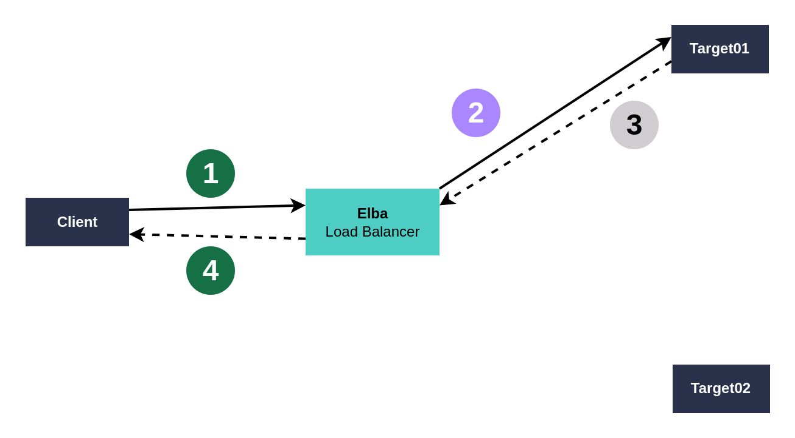
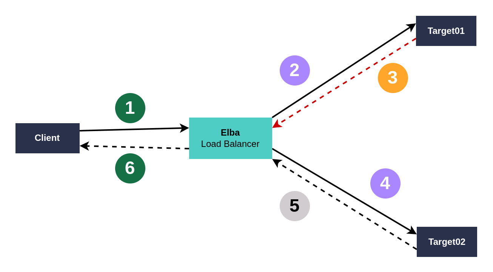
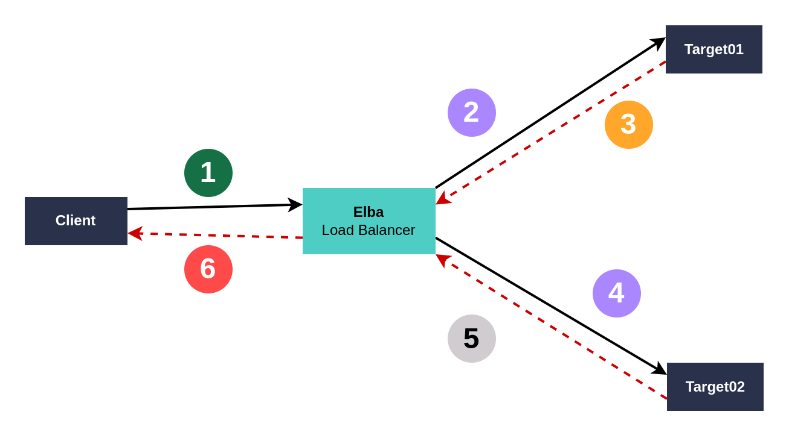
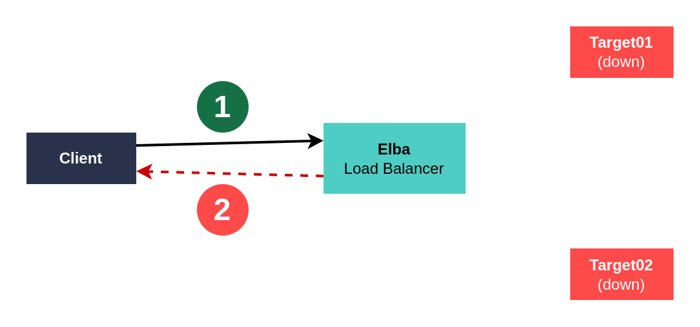

# Elba Logs Module

## Settings

```toml
[server]
verbosity = "debug"   # Minimum verbosity to log: debug,info,warn,error,fatal
```

## What each verbosity logs?

- **fatal**: Errors from which Elba cannot recover itself. Generally only happens on startup: Invalid settings, port in use, no permission to bind to port, no permission to read settings, etc.
- **error**: Errors that will impact the downstream response (check [concepts](./concepts.md)). That is, the error will be seen by the clients.
- **warn**: Errors that won't affect clients due to retries; targets becoming unhealthy.
- **info**: General information about Elba core (server startup, targets becoming healthy) or downstream requests being received.
- **debug**: Elba will log everything, even the time its waiting between requests due to delay/cooldown settings. Useful for troubleshooting.

## What is logged with each downstream request?

### General information

Every step of a request will log:
- **date**: The moment that elba received the request in ISO format.
- **trace**: A tracing ID that allows you to find other logs related to the same request. You can also use this to filter logs by ID, the same id is sent on every downstream response. Check [headers module documentation](./headers.md) for more information.
- **level**: The verbosity of that log, according to the color in the diagram. You can choose what verbosities will be logged in the settings.
- **log**: A short message describing the event.
- **topic**: A topic describing what event generated that log.
- **service**: Which service matched the host of the downstream request. More information in the [load balance module documentation](./load-balance.md).

Every step of a request but the first one will also log:
- **target**: Which upstream target was chosen to receive that attempt of the request. More information in the [load balance module documentation](./load-balance.md).
- **attempt**: The number of this attempt to proxy a downstream request to the upstream targets. 1 is the first attempt, 2 is the first retry (2nd attempt), and so on. More information in the [retry module documentation](./retry.md).
- **delay**: How many milliseconds have passed since Elba received the downstream request.

More information:
- The last upstream response/error is never logged as it would contain the same information as the downstream response/error which **is** logged.
- More steps regarding delay, cooldown, health are logged deppending on your settings.
- A downstream/upstream response is considered an error when the response code is configured as a retryable response. Errors codes can be received as `upstream-response` if they are not configured as retryable and success codes can be received as `upstream-error` if they are configured as retryable. More information on [retry module documentation](./retry.md).

### 1. No retries



Verbosities:
- **Green**: info
- **Purple**: debug
- **Gray**: Not logged

Steps:

1. Elba receives the downstream request and logs on `topic=downstream-request` with verbosity `level=info` and more information about the host and path.
2. Elba chooses a target and sends the request upstream with `topic=upstream-request`, verbosity `level=debug` and more information about which target was chosen. For more information on how a target is chosen, check [load balance module documentation](./load-balance.md).
3. Elba receives the upstream response and doesnt log anything as the next step is taken instantaneously and with the same information.
4. Elba proxies the response downstream with `topic=downstream-response`, verbosity `level=info` and more information about the target, delay.

Example:

```logfmt
trace=87b2b8b4dddc date=2000-01-01T00:00:00.000Z level=info log="got request on http://localhost:8080/hello" topic=downstream-request service=*
trace=87b2b8b4dddc date=2000-01-01T00:00:00.000Z level=debug log="attempting to proxy to Target01" delay=0 topic=upstream-request service=* target=Target01 attempt=1
trace=87b2b8b4dddc date=2000-01-01T00:00:00.000Z level=info log="request completed" delay=322 topic=downstream-response service=* target=Target01 attempt=1
```

### 2. Retries with success



Verbosities:
- **Orange**: warn
- **Green**: info
- **Purple**: debug
- **Gray**: Not logged

Steps:

1. Elba receives the downstream request and logs on `topic=downstream-request` with verbosity `level=info` and more information about the host and path.
2. Elba chooses a target and sends the request upstream with `topic=upstream-request`, verbosity `level=debug` and more information about which target was chosen. For more information on how a target is chosen, check [load balance module documentation](./load-balance.md).
3. The upstream request fails or Elba receives an error from upstream. This is logged with `topic=upstream-error`, verbosity `level=warn`, more information about the error and which target failed.
4. Elba chooses a target and sends the request upstream with `topic=upstream-request`, verbosity `level=debug` and more information about which target was chosen. For more information on how a target is chosen, check [load balance module documentation](./load-balance.md).
5. Elba receives the upstream response and doesnt log anything as the next step is taken instantaneously and with the same information.
6. Elba proxies the response downstream with `topic=downstream-response`, verbosity `level=info` and more information about the target, delay.

Example:

```logfmt
trace=0a41a4c87c4b date=2000-01-01T00:00:00.000Z level=info log="got request on http://localhost:8080/hello" topic=downstream-request service=*
trace=0a41a4c87c4b date=2000-01-01T00:00:00.000Z level=debug log="attempting to proxy to Target01" delay=0 topic=upstream-request service=* target=Target01 attempt=1
trace=0a41a4c87c4b date=2000-01-01T00:00:00.000Z level=warn log="upstream request failed with status 503" delay=599 topic=upstream-error service=* target=Target01 attempt=1
trace=0a41a4c87c4b date=2000-01-01T00:00:00.000Z level=debug log="waiting 100ms before next attempt" topic=delay
trace=0a41a4c87c4b date=2000-01-01T00:00:00.000Z level=debug log="attempting to proxy to Target02" delay=701 topic=upstream-request service=* target=Target02 attempt=2
trace=0a41a4c87c4b date=2000-01-01T00:00:00.000Z level=info log="request completed" delay=2229 topic=downstream-response service=* target=Target02 attempt=2
```


### 3. Retries with error



Verbosities:
- **Red**: error
- **Orange**: warn
- **Green**: info
- **Purple**: debug
- **Gray**: Not logged

Steps:

1. Elba receives the downstream request and logs on `topic=downstream-request` with verbosity `level=info` and more information about the host and path.
2. Elba chooses a target and sends the request upstream with `topic=upstream-request`, verbosity `level=debug` and more information about which target was chosen. For more information on how a target is chosen, check [load balance module documentation](./load-balance.md).
3. The upstream request fails or Elba receives an error from upstream. This is logged with `topic=upstream-error`, verbosity `level=warn`, more information about the error and which target failed.
4. Elba chooses a target and sends the request upstream with `topic=upstream-request`, verbosity `level=debug` and more information about which target was chosen. For more information on how a target is chosen, check [load balance module documentation](./load-balance.md).
5. Elba receives the upstream error and doesnt log anything as the next step is taken instantaneously and with the same information. In this example the service is configured with two attempts, if there were more, the steps two and three would repeat.
6. Elba proxies the response downstream with `topic=downstream-error`, verbosity `level=error` and more information about the target, delay and error.

Example:

```logfmt
trace=a1654e5121c3 date=2000-01-01T00:00:00.000Z level=info log="got request on http://localhost:8080/hello" topic=downstream-request service=*
trace=a1654e5121c3 date=2000-01-01T00:00:00.000Z level=debug log="attempting to proxy to Target01" delay=0 topic=upstream-request service=* target=Target01 attempt=1
trace=a1654e5121c3 date=2000-01-01T00:00:00.000Z level=warn log="upstream request failed with status 503" delay=592 topic=upstream-error service=* target=Target01 attempt=1
trace=a1654e5121c3 date=2000-01-01T00:00:00.000Z level=debug log="waiting 100ms before next attempt" topic=delay
trace=a1654e5121c3 date=2000-01-01T00:00:00.000Z level=debug log="attempting to proxy to Target02" delay=693 topic=upstream-request service=* target=Target02 attempt=2
trace=a1654e5121c3 date=2000-01-01T00:00:00.000Z level=error log="downstream request failed after limit with status 503" delay=1149 topic=downstream-error service=* target=Target02 attempt=2
```

### 4. No available targets



Verbosities:
- **Red**: error
- **Green**: info

Steps:

1. Elba receives the downstream request and logs on `topic=downstream-request` with verbosity `level=info` and more information about the host and path.
2. As no target is available and `service.health.none_healthy_is_all_healhty` is set to false in our example, Elba responds downstream immediatly with a 503 error and logs with `topic=downstream-error`, verbosity `level=error`. **In this case the target is set to elba and the attempt count to zero**: `target=elba attempt=0` as no upstream target was used.

Example:

```logfmt
trace=5a989d76cd82 date=2000-01-01T00:00:00.000Z level=info log="got request on http://localhost:8080/hello" topic=downstream-request service=*
trace=5a989d76cd82 date=2000-01-01T00:00:00.000Z level=error log="downstream request failed after limit with error: Error: request failed because all the targets are unhealthy and health.none_healthy_is_all_healthy is unset or false" delay=0 topic=downstream-error service=* target=elba attempt=0
```
